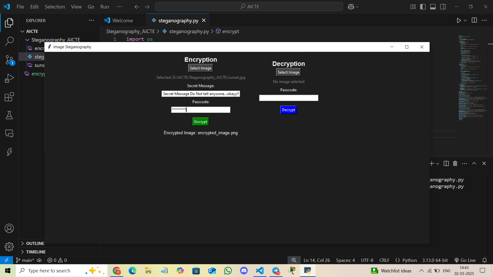
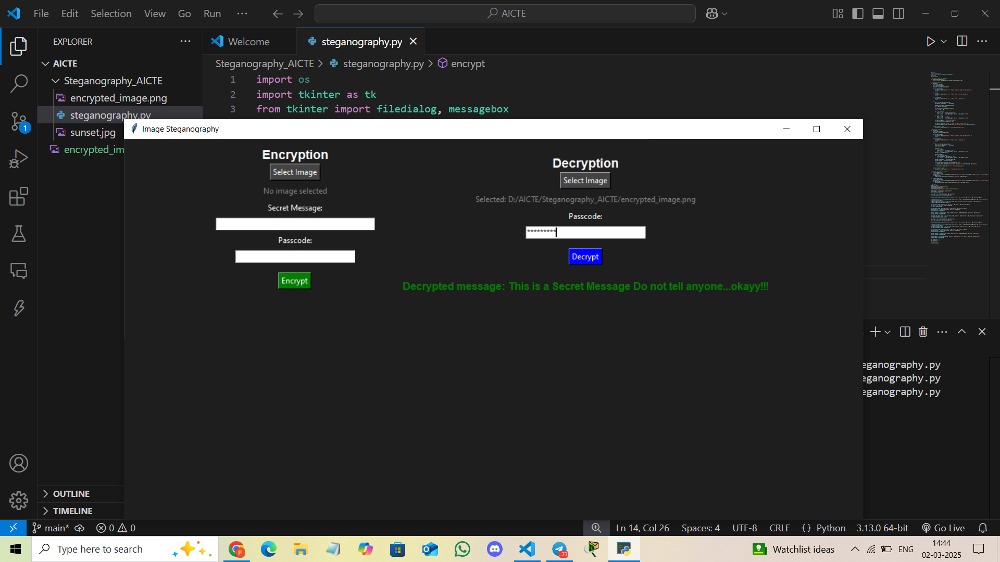

# 📌 Secure Data Hiding in Images Using Steganography  

🔒 **Hide Your Secrets in Plain Sight!** 🔒  

Welcome to **Steganography_AICTE**, a powerful tool that enables you to securely embed secret messages within images using **image steganography**. With an easy-to-use graphical interface, you can encrypt your messages into images and retrieve them later with a passcode.  

---

## 🚀 Features  
✅ **Secure Encryption:** Hides secret messages inside images.  
✅ **Password Protection:** Messages are protected with a passcode to prevent unauthorized access.  
✅ **User-Friendly GUI:** Simple and interactive **Tkinter-based** interface.  
✅ **Fast & Lightweight:** Efficient steganography without compromising image quality.  
✅ **Output Files Generated:**  
   - **Encrypted Image:** `encrypted_image.png` (Contains the hidden message).  

---

## 📂 Installation & Requirements  

### 🔧 Prerequisites  
Ensure you have **Python 3.x** installed on your system. You also need to install the following dependencies:  

```bash
pip install opencv-python tkinter
```

---

## 🛠️ How to Run  

1️⃣ **Clone this repository** (or download the project files):  
```bash
git clone https://github.com/your-username/Steganography_AICTE.git
cd Steganography_AICTE
```

2️⃣ **Run the script:**  
```bash
python steganography.py
```

3️⃣ **Use the GUI to encrypt or decrypt messages:**  
- Select an image for encryption.  
- Enter your secret message & passcode.  
- Click **Encrypt** to hide the message inside the image.  
- The output file will be saved as **`encrypted_image.png`**.  
- Select the encrypted image and enter the passcode to retrieve your message.  

---

## 📷 How It Works  

🔹 **Encryption Process:**  
- The message is prefixed with a hashed version of the passcode.  
- The image’s pixels are modified to store the message characters.  
- The output image contains the hidden message securely.  

🔹 **Decryption Process:**  
- Extracts the hidden message from the image.  
- Verifies the passcode by checking the stored hash.  
- Reveals the original secret message only if the passcode is correct.  

---

## 🔒 Security Notice  

⚠️ While this project ensures **basic security** through passcode hashing, it is **not intended for high-level cryptographic security**. For highly sensitive data, consider **strong encryption methods** in addition to steganography.  

---

## 📂 Output Files  

## 📷 GUI Preview  
 
 
---

💡 **Happy Encrypting! Keep Your Secrets Safe!** 🔥🔑
